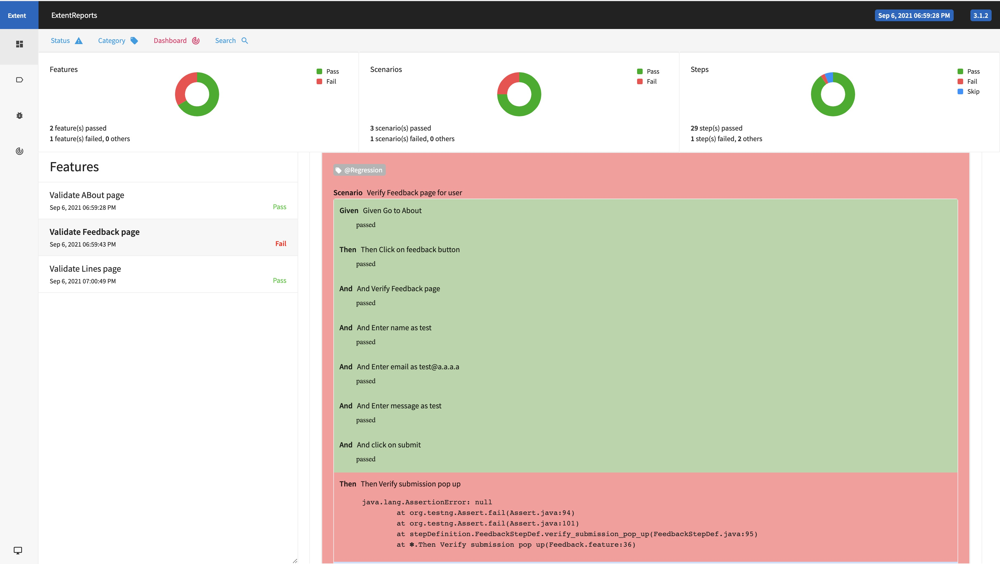

# Mobile-Automation

This is the sample mobile test automation suite in which any test scenario can be included like below:

# Automation Framework
Currently we are using Page Object model design pattern for the test automation that creates Object Repository for web UI element.

The page object model allows us to embed custom code within each method and abstract away from it. Each method may be performing trivial actions against a UI, or might feature complex code which is performing advanced operations like going into backend databases, performing API requests, handling email approvals, spinning up environments, and more. The key premise is that the page object model facilitates and hides the complexity of the routines taking place and exposes them in an elegant interface that can be used in a test scenario with ease.

# Page Object Model:

Based upon design pattern used for software development

Models the pages/screen of application as objects – Page Objects

Page Objects encapsulates all functions that can be performed on page

# List of required software/Tech stack

Below softwares/tools/plugins are used for this suite:

IntelliJ

Git Bash

PostgreSQL

Selenium

Cucumber

Java

Appium

Android Studio

###Sample test case for Mobile app Automation

####Scenario 1: Validate Lines Page  
Verify footers on app  
Click on lines button  
Verify Header and scroll all buses on Lines page till Bus Number  
Click on direction  
Verify Line Map page  

We can add more examples as well. The main focus is only on the common framework and not on the test cases as app is not available yet.

# Getting Started

Please follow below instruction to copy the project and running on your local machine for testing purpose

#### Prerequisites

Maven home: apache-maven-3.5.3

Android Studio 3.4.1

Java version: 1.8.0_201, vendor: Oracle Corporation

Appium Version: 1.13.0

### Android SDK should be downloaded first in the system and once it is downloaded , below properties should be added in bash_profile like below  
1. vim ~/.bash_profile  
2. add below properties  
export ANDROID_HOME=/Users/(userName)/Library/Android/sdk  
export PATH=$PATH:/Users/(userName)/Library/Android/sdk/build-tools  
export PATH=$PATH:/Users/(userName)/Library/Android/sdk/platform-tools  
export PATH=$PATH:/Users/(userName)/Library/Android/sdk/tools  
export JAVA_HOME=$(/usr/libexec/java_home)  
export PATH=${PATH}$JAVA_HOME/bin  

#### " (userName) " is the username of the system. Basically " /Users/<userName>/Library/Android/sdk " is the path of the SDK folder. you can place it at your desktop as well.

3. Open Android sdk and go to  
Tools > AVD Manager  
4. Download Pixel 2 API level 30 android OS 11
5. Change apk path name in Config.properties file like below :  

##### ApkPath=/Users/(userName)/Desktop/Automation/Mobile/android/app-debug.apk

Git Bash

# Running the tests

Given scenario is automated using selenium cucumber with BDD.
Gherkin language is used in cucumber for these scenario.

#### Below is the work flow of calling methods in this framework

Feature File >>>> Step Definition File >>>> Main File

For example: Feature file is created for Automation demo in which scenario is written in gherkin language.
This feature file calls step definition file through glue code.
Then step definition file calls main page file in which all methods are defined.

# Installation

### Linux Machine

If you’re on Fedora for example (or any closely-related RPM-based distro such as RHEL or CentOS), you can use below command to install Git:
##### $ sudo dnf install git-all

If you’re on a Debian-based distribution like Ubuntu, try apt-get:
##### $ sudo apt-get install git-all

Install Maven
#### $ sudo apt-get install maven

1. Open Android sdk and go to  
   Tools > AVD Manager  

2. Open Nexus 6P android 8.1 emulator

3. Clone the project from below location:

git@github.com:vishalverma21/Timetable.git

4. Go to source folder in local machine

timetable

5. Run " mvn test " command in source folder " timetable " from your maven or git bash
mvn test

Report

For report - Open target folder after executing the project and open extent.html

